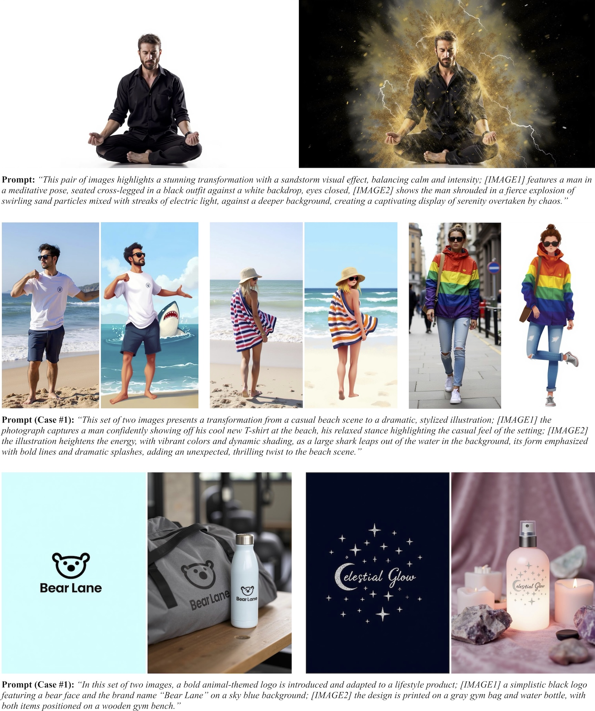

# In-Context LoRA (IC-LoRA)

- [x] Training & Inference Code: Released (directly uses [AI-Toolkit](https://github.com/ostris/ai-toolkit); see [Getting Started](#getting-started) for details)
- [x] Sample Training Data & Configuration File: Available in this repository for easy setup
- [ ] Model Checkpoints: Comming Soon

Welcome to the official repository of **In-Context LoRA for Diffusion Transformers** ([arXiv Paper](https://arxiv.org/abs/2410.23775) and [Project Page](https://ali-vilab.github.io/In-Context-LoRA-Page/)).

With IC-LoRA, you can fine-tune text-to-image models to **generate image sets** with customizable intrinsic relationships. You can also **condition the generation on another image set**, enabling task-agnostic adaptation to a wide range of applications.



For more detailed information and examples, please read our [arXiv Paper](https://arxiv.org/abs/2410.23775) or visit our [Project Page](https://ali-vilab.github.io/In-Context-LoRA-Page/).

## Getting Started

You can directly use the open-source [AI-Toolkit](https://github.com/ostris/ai-toolkit) to train IC-LoRA models. We have provided sample training data with a configuration file in this repo:

- **Configuration File**: `config/movie-shots.yml` (place it in the `config/` directory of AI-Toolkit)
- **Sample Training Data**: `data/movie-shots.zip` (extract it to `data/movie-shots` of AI-Toolkit)

After installing the necessary dependencies and setting up AI-Toolkit, you can start training by running:

```bash
python run.py config/movie-shots.yml
```

The training runs on a single GPU with at least 24GB of memory (adjust the `resolution` parameter in `config/movie-shots.yml` for different GPU memory limits). The training should complete in a few hours.

## Prompt for Multi-Scene Image Captioning

As a reference, we provide an example prompt used to generate captions for multi-scene images:

> *Create a short description of this three-scene image featuring movie shots, beginning with the prefix [MOVIE-SHOTS] for the entire caption, followed by an overall summary of the image. Each scene detail should flow within the same sentence, with specific markers [SCENE-1], [SCENE-2], [SCENE-3], indicating the start of each scene’s description. Name the role(s) with random name(s) if necessary, and wrap the name(s) with "<" and ">". Ensure the entire description is cohesive, flows as one sentence, and remains within 512 words.*

## MODEL ZOO

We will continue to release In-Context LoRA models. Please stay tuned.

## License

This repository uses [FLUX](https://github.com/black-forest-labs/flux) as the base model. Users must comply with FLUX's license when using this code. Please refer to [FLUX's License](https://github.com/black-forest-labs/flux/tree/main/model_licenses) for more details.

**DISCLAIMER**: Please be aware that the training data provided in this repository may contain copyrighted material. The open-source data is intended for reference and educational purposes only. If you plan to use this data for commercial purposes, you are responsible for obtaining the necessary permissions and ensuring compliance with all applicable copyright laws and regulations.

## Citation

If you find this work useful in your research, please consider citing:

```bibtex
@article{lhhuang2024iclora,
  title={In-Context LoRA for Diffusion Transformers},
  author={Huang, Lianghua and Wang, Wei and Wu, Zhi-Fan and Shi, Yupeng and Dou, Huanzhang and Liang, Chen and Feng, Yutong and Liu, Yu and Zhou, Jingren},
  journal={arXiv preprint arxiv:2410.23775},
  year={2024}
}
```
